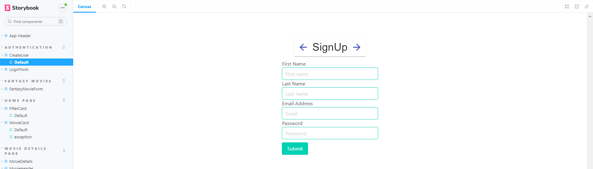

# ICT Skills 2 Assignment.

Name: Stephen Swanton
## Overview.

This project builds on the features developed in assignment 1 to extend the range of endpoints consumed by the movie client app so that end users can access information regarding:

- Popular Actors, including movies in which they appear
- TV series
- Movies similar to individual movies

The filtering functionality was extended to include release date.  
Sorting functionality was also introduced to allow *ascending* and *descending* sort by *Title* and by *Release Date*

All sections feature extensive hyperlinking to allow the user to effectively navigate throughout the site.

Routing features include  a mix of static and parameterized URLs and protected URLs  
A hapi-mongodb backend was created to provide user authentication for protected routes [code available in the following repository https://github.com/StephenSwantonIRL/movie-back-end] 

A *My Fantasy movies* feature was also partially implemented to permit logged in users to add create movies in the movies backend that capture:

- Title
- Genre (using list provided by TMDB)
- Release Date
- Plot
- Cast (searching the TMDB database to retrieve results, and allow users select cast members from matching actors)

The app relies on the react-query library to cache results and reduce unnecessary server queries.

– Storybook support.

## Setup requirements.

You must have Node version 16.8 or above installed to install this application. You also need to sign up for an account and API key on TMDB  (Details available here https://developers.themoviedb.org/3/getting-started/authentication)

- Clone the project repository to your local machine using the following command  
  `git clone https://github.com/StephenSwantonIRL/ict-assignment2.git`
- Open a command prompt in the project folder.
- Run the following command `npm install `
- Create a `.env` file in the project root folder and populate the file with the following variables.  
  -- REACT_APP_TMDB_KEY=**yourTMDBapiKey**  
  -- FAST_REFRESH=false
- Run `npm run build` to create a build version for the production environment.
- Your app is now ready to deploy on your hosting of choice. For further information on possible deployment options visit https://create-react-app.dev/docs/deployment/

## App Design.

### Routing/Navigation.

The following are new routes created in addition to the routes existing in the Assignment 1 version of the application
- /list   - This lists the fantasy movies created by a user
- /fantasy - This renders a create fantasy movie form that submits the information to the movie app backend.
- /login - this allows a user to log in and access protected routes
- /signup - this allows a user to sign up and create an account on the backend
- /tv  - this displays the first page of results from the Discover TV end point
- /tv/:id - this displays details related to a TV Series :id is the TMDB id of the series
- /actors - this displays the first page of results from the Popular People end point
- /actors/:id - this displays details of an actor and also the list of movies in which they are credited .

### Views/Pages.

[ For each view in your app, show a screenshot and caption - only new/modified ones in the case of the Movies Fan app. If necessary, use multiple screenshots to cover a view's full capability.

e.g.
>Lists movies from the Discover endpoint. Filtering on title and genre attributes is supported.
> 

 
> Fig. 1 Login  page 

> Fig. 2 Sign up Page

> Fig. 3 Create Fantasy Movie Page

> Fig. 4 List view of User's Fansty Movies

> Fig. 5 Example of Dropdown Menu

> Fig. 6 Page renders results of TV Series Discover Endpoint

> Fig. 7 Page renders details page for an individual TV series

> Fig. 8 Highlights addition of similar movies to Movie Detail Page

> Fig. 9 Page renders results of Popular People endpoint 

> Fig. 10 Page renders details page for an actor

### Component catalogue.

New Components added to the component library for which stories were created were:

SERIES DETAILS PAGE
- SeriesCard

- SeriesDetails

SERIES LIST PAGE 
- SeriesList

AUTHENTICATION
- CreateUser

- LoginForm
  

FANTASY MOVIES
- FantasyMovieForm

  
## Caching.

In addition to the caching available in the assignment 1 version of the application the following have been implemented.

- Discover TV Series

- Individual TV Series Details

> Note caching of individual series

- Popular Actor List

- Actor Details - including actor credits

## Authentication.

Authentication relies on the user receiving a JWT token from the back end which is stored in the AuthContext. The protectedRoute component is used to wrap the intended page/component in the router. This component checks the AuthContext to determine if a token has been set for the user and if a user token is set proceeds to render the child component/page. If no token is set the user navigates to the login page to sign in.

Protection is applied to the following routes.
- /list
- /fantasy
- /movies/favourites
- /movies/mustwatch

## Server-side persistence
Server side persistence is available for Users and Fantasy Movies created in the system via the hapi-mongo movies-app-backend [https://github.com/StephenSwantonIRL/movie-back-end]. Fields currently stored in the back end are:

**USER**
- Email Address  - which also functions as the user's username
- Password

**FANTASY MOVIE**
- Title
- Genre
- Plot
- Release Date
- Cast consisting of array of Actors (name, role and TMDB ID)

The backend app is easily extensible to support persistence of additional data types.
JWT authentication is possible by enabling the JWT auth strategy on the back end.

## Sorting
The filterCard Component was updated to include a new sortOptions component. This renders a button enabling the user to select whether they would like to sort in ascending or descending order and a radio button selector to select which property to sort by. Currently the user can select to sort by either release date or by title. 
 